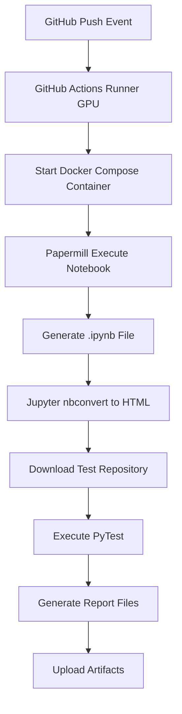
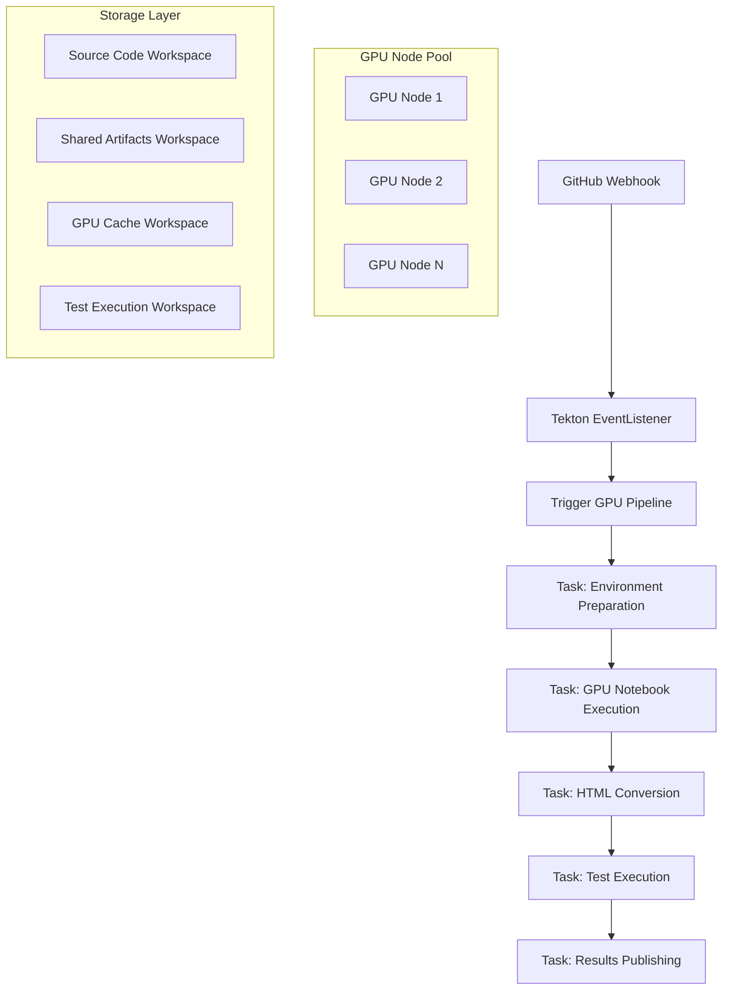

# GPU Scientific Computing Tekton Pipeline Migration Guide

Complete guide for migrating GitHub Actions GPU workflows to Tekton

## 📋 Table of Contents

1. [Overview](#overview)
2. [Architecture Comparison](#architecture-comparison)
3. [Environment Setup](#environment-setup)
4. [Quick Deployment](#quick-deployment)
5. [Detailed Configuration](#detailed-configuration)
6. [Usage Guide](#usage-guide)
7. [Monitoring & Debugging](#monitoring--debugging)
8. [Performance Optimization](#performance-optimization)
9. [Troubleshooting](#troubleshooting)
10. [Best Practices](#best-practices)

## 🎯 Overview

This guide helps you completely migrate existing GitHub Actions GPU scientific computing workflows to Tekton, achieving:

### Original GitHub Actions Workflow



### New Tekton Pipeline Architecture



### Migration Benefits

- ✅ **Elastic Scaling**: Automatic GPU resource scheduling and load balancing
- ✅ **Cost Optimization**: On-demand GPU resource usage, avoiding waste
- ✅ **High Availability**: Containerized execution with automatic failure recovery
- ✅ **Standardization**: Based on Kubernetes native toolchain
- ✅ **Observability**: Complete logging, monitoring, and alerting

## 🔄 Architecture Comparison

### GitHub Actions vs Tekton

| Feature | GitHub Actions | Tekton |
|---------|---------------|--------|
| **Runtime Environment** | VM-based Runners | Kubernetes Pods |
| **GPU Scheduling** | Fixed Runner | K8s GPU Scheduler |
| **Resource Utilization** | Exclusive | Shared, efficient utilization |
| **Scalability** | Manual scaling | Auto elastic scaling |
| **Storage** | Runner local storage | PV/PVC persistent storage |
| **Monitoring** | Actions built-in | Prometheus + Grafana |
| **Cost** | Charged by Runner time | Charged by actual resource usage |

### Workflow Correspondence

| GitHub Actions Step | Tekton Task | Description |
|-------------------|-------------|-------------|
| Code Checkout | `gpu-env-preparation` | Git clone + environment validation |
| Docker Compose Start | `gpu-papermill-execution` | Execute Papermill in GPU container |
| Papermill Execution | `gpu-papermill-execution` | Execute Notebook using GPU |
| Jupyter nbconvert | `jupyter-nbconvert` | Convert to HTML format |
| Download Test Repo + PyTest | `pytest-execution` | Test framework download and execution |
| Upload Artifacts | `publish-results` | Results collection and publishing |

## 🛠️ Environment Setup

### Prerequisites

#### 1. Kubernetes Cluster Requirements

```bash
# Check cluster version (recommend 1.24+)
kubectl version --short

# Check GPU support
kubectl get nodes -o wide
kubectl describe node <gpu-node-name>
```

#### 2. GPU Node Configuration

```bash
# Install NVIDIA GPU Operator (if not installed)
kubectl apply -f https://raw.githubusercontent.com/NVIDIA/gpu-operator/main/deployments/gpu-operator.yaml

# Label GPU nodes
kubectl label nodes <gpu-node-name> accelerator=nvidia-tesla-gpu

# Verify GPU resources
kubectl get nodes -o jsonpath='{.items[*].status.allocatable.nvidia\.com/gpu}'
```

#### 3. Storage Configuration

```yaml
# High-performance storage class example
apiVersion: storage.k8s.io/v1
kind: StorageClass
metadata:
  name: fast-ssd
provisioner: kubernetes.io/aws-ebs
parameters:
  type: gp3
  iops: "3000"
  throughput: "125"
volumeBindingMode: WaitForFirstConsumer
```

#### 4. Tekton Installation

```bash
# Install Tekton Pipelines
kubectl apply -f https://storage.googleapis.com/tekton-releases/pipeline/latest/release.yaml

# Install Tekton Triggers
kubectl apply -f https://storage.googleapis.com/tekton-releases/triggers/latest/release.yaml
kubectl apply -f https://storage.googleapis.com/tekton-releases/triggers/latest/interceptors.yaml

# Verify installation
kubectl get pods -n tekton-pipelines
kubectl get crd | grep tekton
```

## 🚀 Quick Deployment

### One-Click Deployment Script

```bash
# Clone the project
git clone https://github.com/your-org/Real-world_Tekton_Installation_Guide.git
cd Real-world_Tekton_Installation_Guide

# Execute Chinese deployment script
chmod +x scripts/zh/deploy-gpu-pipeline.sh
./scripts/zh/deploy-gpu-pipeline.sh

# Or execute English deployment script
chmod +x scripts/en/deploy-gpu-pipeline.sh
./scripts/en/deploy-gpu-pipeline.sh
```

### Deployment Verification

```bash
# Check all component status
kubectl get tasks,pipelines,eventlisteners -n tekton-pipelines

# View EventListener service
kubectl get svc -n tekton-pipelines
kubectl describe eventlistener gpu-scientific-computing-eventlistener -n tekton-pipelines
```

## ⚙️ Detailed Configuration

### 1. Tasks Configuration Details

#### GPU Environment Preparation Task

```yaml
# examples/tasks/gpu-env-preparation-task.yaml
apiVersion: tekton.dev/v1
kind: Task
metadata:
  name: gpu-env-preparation
spec:
  description: |
    Environment preparation for GPU scientific computing workflow
  params:
  - name: git-repo-url
    description: Git repository URL to clone
  - name: git-revision
    description: Git revision to checkout
    default: "main"
  workspaces:
  - name: source-code
    description: Workspace for source code checkout
  - name: shared-storage
    description: Shared storage for artifacts
  # ... See actual file for detailed configuration
```

#### GPU Papermill Execution Task

```yaml
# examples/tasks/gpu-papermill-execution-task.yaml
apiVersion: tekton.dev/v1
kind: Task
metadata:
  name: gpu-papermill-execution
  labels:
    tekton.dev/gpu-required: "true"
spec:
  description: |
    GPU-accelerated Papermill execution task
  params:
  - name: gpu-count
    description: Number of GPUs required
    default: "1"
  - name: memory-limit
    description: Memory limit for the container
    default: "32Gi"
  - name: container-image
    description: GPU-enabled container image
    default: "nvcr.io/nvidia/rapidsai/notebooks:25.04-cuda12.8-py3.12"
  # ... GPU resource configuration
  resources:
    limits:
      nvidia.com/gpu: $(params.gpu-count)
      memory: $(params.memory-limit)
      cpu: "8"
    requests:
      nvidia.com/gpu: $(params.gpu-count)
      memory: "16Gi"
      cpu: "4"
```

### 2. Pipeline Configuration

```yaml
# examples/pipelines/gpu-scientific-computing-pipeline.yaml
apiVersion: tekton.dev/v1
kind: Pipeline
metadata:
  name: gpu-scientific-computing-pipeline
spec:
  description: |
    GPU-accelerated scientific computing pipeline
  params:
  - name: git-repo-url
    description: Git repository URL
  - name: gpu-count
    description: Number of GPUs required
    default: "1"
  workspaces:
  - name: source-code-workspace
  - name: shared-artifacts-workspace
  - name: gpu-cache-workspace
  - name: test-execution-workspace
  
  tasks:
  - name: prepare-environment
    taskRef:
      name: gpu-env-preparation
  - name: execute-notebook-gpu
    taskRef:
      name: gpu-papermill-execution
    runAfter: ["prepare-environment"]
  - name: convert-to-html
    taskRef:
      name: jupyter-nbconvert
    runAfter: ["execute-notebook-gpu"]
  - name: run-tests
    taskRef:
      name: pytest-execution
    runAfter: ["convert-to-html"]
  - name: publish-results
    runAfter: ["run-tests"]
    # ... Inline Task definition
```

### 3. Triggers Configuration

#### EventListener

```yaml
# examples/triggers/gpu-pipeline-trigger-template.yaml
apiVersion: triggers.tekton.dev/v1beta1
kind: EventListener
metadata:
  name: gpu-scientific-computing-eventlistener
spec:
  triggers:
  - name: gpu-scientific-computing-trigger
    interceptors:
    # GitHub webhook interceptor
    - ref:
        name: "github"
      params:
      - name: "secretRef"
        value:
          secretName: github-webhook-secret
          secretKey: webhook-secret
      - name: "eventTypes"
        value: ["push", "pull_request"]
    
    # CEL filter
    - ref:
        name: "cel"
      params:
      - name: "filter"
        value: >
          (body.ref == 'refs/heads/main' || 
           body.ref == 'refs/heads/develop') &&
          (body.head_commit.message.contains('[gpu]') ||
           body.head_commit.message.contains('[notebook]') ||
           body.head_commit.modified.exists(f, f.contains('notebooks/')))
```

### 4. GitHub Webhook Configuration

#### Setup Steps

1. Go to GitHub repository settings
2. Select "Webhooks" > "Add webhook"
3. Configure parameters:

```
Payload URL: http://<EXTERNAL_IP>:8080
Content type: application/json
Secret: <WEBHOOK_SECRET>  # Secret generated by deployment script
SSL verification: Enable SSL verification (if using HTTPS)
Events: Just the push event or Send me everything
```

#### Trigger Conditions

The Pipeline will automatically trigger in the following cases:

- Push to `main` or `develop` branch
- Commit message contains `[gpu]` or `[notebook]` tags
- Modify files in the `notebooks/` directory

## 📖 Usage Guide

### Manual Pipeline Execution

```bash
# Create manual PipelineRun
cat <<EOF | kubectl apply -f -
apiVersion: tekton.dev/v1
kind: PipelineRun
metadata:
  generateName: gpu-manual-run-
  namespace: tekton-pipelines
spec:
  pipelineRef:
    name: gpu-scientific-computing-pipeline
  params:
  - name: git-repo-url
    value: "https://github.com/your-org/your-repo.git"
  - name: git-revision
    value: "main"
  - name: notebook-path
    value: "notebooks/01_scRNA_analysis_preprocessing.ipynb"
  - name: gpu-count
    value: "1"
  workspaces:
  - name: source-code-workspace
    volumeClaimTemplate:
      spec:
        accessModes: ["ReadWriteOnce"]
        resources:
          requests:
            storage: 10Gi
        storageClassName: fast-ssd
  - name: shared-artifacts-workspace
    volumeClaimTemplate:
      spec:
        accessModes: ["ReadWriteOnce"]
        resources:
          requests:
            storage: 50Gi
        storageClassName: fast-ssd
  - name: gpu-cache-workspace
    volumeClaimTemplate:
      spec:
        accessModes: ["ReadWriteOnce"]
        resources:
          requests:
            storage: 100Gi
        storageClassName: fast-nvme
  - name: test-execution-workspace
    volumeClaimTemplate:
      spec:
        accessModes: ["ReadWriteOnce"]
        resources:
          requests:
            storage: 5Gi
        storageClassName: fast-ssd
  timeout: "2h"
EOF
```

### View Execution Status

```bash
# List PipelineRuns
kubectl get pipelineruns -n tekton-pipelines

# View specific PipelineRun details
kubectl describe pipelinerun <pipelinerun-name> -n tekton-pipelines

# View TaskRun status
kubectl get taskruns -n tekton-pipelines

# View Pod status
kubectl get pods -n tekton-pipelines
```

### View Logs

```bash
# View PipelineRun logs
kubectl logs -f -n tekton-pipelines <pipelinerun-pod-name>

# View specific Task logs
kubectl logs -f -n tekton-pipelines <taskrun-pod-name> -c step-<step-name>

# View GPU execution Task logs
kubectl logs -f -n tekton-pipelines <gpu-papermill-pod-name> -c step-gpu-papermill-execute
```

## 📊 Monitoring & Debugging

### Monitoring Metrics

#### 1. Cluster Level Monitoring

```bash
# GPU resource usage
kubectl top nodes
kubectl get nodes -o jsonpath='{.items[*].status.allocatable.nvidia\.com/gpu}'

# Storage usage
kubectl get pv
kubectl top pods -n tekton-pipelines
```

#### 2. Pipeline Monitoring

```bash
# Pipeline execution history
kubectl get pipelineruns -n tekton-pipelines -o wide

# Success rate statistics
kubectl get pipelineruns -n tekton-pipelines -o jsonpath='{.items[*].status.conditions[0].reason}' | tr ' ' '\n' | sort | uniq -c

# Execution time analysis
kubectl get pipelineruns -n tekton-pipelines -o custom-columns=NAME:.metadata.name,START:.status.startTime,COMPLETION:.status.completionTime
```

#### 3. Resource Monitoring

```yaml
# Prometheus monitoring configuration example
apiVersion: v1
kind: ServiceMonitor
metadata:
  name: tekton-pipelines-monitor
spec:
  selector:
    matchLabels:
      app: tekton-pipelines
  endpoints:
  - port: metrics
    interval: 30s
    path: /metrics
```

### Debugging Techniques

#### 1. Common Issue Diagnosis

```bash
# Check GPU resource availability
kubectl describe node <gpu-node-name> | grep -A 10 "Allocated resources"

# Check storage classes and PVCs
kubectl get storageclass
kubectl get pvc -n tekton-pipelines

# Check Pod scheduling
kubectl get pods -n tekton-pipelines -o wide
kubectl describe pod <stuck-pod-name> -n tekton-pipelines
```

#### 2. Log Analysis

```bash
# Check EventListener logs
kubectl logs -f deployment/el-gpu-scientific-computing-eventlistener -n tekton-pipelines

# Check Webhook trigger logs
kubectl logs -f -l app=tekton-triggers-controller -n tekton-pipelines

# Check GPU Task execution logs
kubectl logs -f <gpu-task-pod> -n tekton-pipelines -c step-gpu-papermill-execute
```

#### 3. Performance Analysis

```bash
# Analyze GPU utilization
kubectl exec -it <gpu-pod-name> -n tekton-pipelines -- nvidia-smi

# Analyze storage I/O
kubectl exec -it <task-pod> -n tekton-pipelines -- iostat -x 1

# Analyze memory usage
kubectl top pod <pod-name> -n tekton-pipelines --containers
```

## ⚡ Performance Optimization

### 1. GPU Resource Optimization

#### GPU Node Pool Configuration

```yaml
# GPU node pool affinity
apiVersion: apps/v1
kind: Deployment
metadata:
  name: gpu-workload
spec:
  template:
    spec:
      nodeSelector:
        accelerator: nvidia-tesla-gpu
      tolerations:
      - key: nvidia.com/gpu
        operator: Exists
        effect: NoSchedule
      affinity:
        nodeAffinity:
          preferredDuringSchedulingIgnoredDuringExecution:
          - weight: 100
            preference:
              matchExpressions:
              - key: gpu-memory
                operator: Gt
                values: ["16000"]
```

#### GPU Multi-Instance Configuration

```yaml
# GPU Multi-Instance GPU (MIG) configuration
resources:
  limits:
    nvidia.com/gpu: 1  # Full GPU
    # Or use MIG instances
    nvidia.com/mig-1g.5gb: 1  # 1/7 GPU instance
```

### 2. Storage Optimization

#### Caching Strategy

```yaml
# GPU cache volume configuration
- name: gpu-cache-workspace
  persistentVolumeClaim:
    claimName: gpu-cache-pvc
    # Use local NVMe storage
    storageClass: local-nvme
    # Enable cache preheating
    accessModes: ["ReadWriteOnce"]
    resources:
      requests:
        storage: 500Gi
```

#### Data Preloading

```bash
# Preload common datasets
kubectl create configmap common-datasets \
  --from-file=dataset1.csv \
  --from-file=dataset2.parquet \
  -n tekton-pipelines
```

### 3. Parallelization Optimization

#### Parallel Task Execution

```yaml
# Parallel Task configuration
tasks:
- name: download-test-framework
  taskRef:
    name: test-framework-setup
  runAfter: ["prepare-environment"]  # Parallel with GPU Task

- name: execute-notebook-gpu
  taskRef:
    name: gpu-papermill-execution
  runAfter: ["prepare-environment"]  # Parallel execution
```

#### Workspace Sharing Optimization

```yaml
# Use ReadWriteMany volumes for better concurrency performance
workspaces:
- name: shared-data
  persistentVolumeClaim:
    claimName: shared-data-pvc
    accessModes: ["ReadWriteMany"]  # Support multiple Pod simultaneous access
    storageClassName: efs-storage-class
```

## 🔧 Troubleshooting

### Common Issues and Solutions

#### 1. GPU Scheduling Failure

**Issue**: Pod cannot be scheduled to GPU nodes

```bash
# Diagnosis steps
kubectl describe pod <pod-name> -n tekton-pipelines
# Check Events section for error messages

# Common causes and solutions
# 1. Insufficient GPU resources
kubectl get nodes -o jsonpath='{.items[*].status.allocatable.nvidia\.com/gpu}'
kubectl describe node <gpu-node> | grep -A 10 "Allocated resources"

# 2. Missing node labels
kubectl label nodes <node-name> accelerator=nvidia-tesla-gpu

# 3. GPU Operator not installed
kubectl get pods -n gpu-operator-resources
```

#### 2. Storage Issues

**Issue**: PVC cannot bind or insufficient storage space

```bash
# Check storage classes
kubectl get storageclass
kubectl describe storageclass fast-ssd

# Check PVC status
kubectl get pvc -n tekton-pipelines
kubectl describe pvc <pvc-name> -n tekton-pipelines

# Check available storage
kubectl get pv
```

#### 3. Network Connection Issues

**Issue**: GitHub Webhook cannot trigger Pipeline

```bash
# Check EventListener service
kubectl get svc -n tekton-pipelines
kubectl describe svc el-gpu-scientific-computing-eventlistener -n tekton-pipelines

# Check Webhook configuration
kubectl get eventlistener gpu-scientific-computing-eventlistener -n tekton-pipelines -o yaml

# Test Webhook connection
curl -X POST http://<external-ip>:8080 \
  -H "Content-Type: application/json" \
  -d '{"test": "webhook"}'
```

#### 4. Container Image Issues

**Issue**: GPU container image pull failure or runtime exception

```bash
# Check if image is available
docker pull nvcr.io/nvidia/rapidsai/notebooks:25.04-cuda12.8-py3.12

# Check image pull policy
kubectl describe pod <pod-name> -n tekton-pipelines | grep -A 5 "Image"

# Check image registry access permissions
kubectl get secrets -n tekton-pipelines
```

### Log Collection Script

```bash
#!/bin/bash
# Troubleshooting log collection script

LOG_DIR="tekton-gpu-logs-$(date +%Y%m%d-%H%M%S)"
mkdir -p "$LOG_DIR"

# Collect cluster information
kubectl cluster-info > "$LOG_DIR/cluster-info.txt"
kubectl get nodes -o wide > "$LOG_DIR/nodes.txt"
kubectl get storageclass > "$LOG_DIR/storage-classes.txt"

# Collect Tekton component status
kubectl get all -n tekton-pipelines > "$LOG_DIR/tekton-resources.txt"
kubectl get pipelineruns -n tekton-pipelines -o yaml > "$LOG_DIR/pipelineruns.yaml"
kubectl get taskruns -n tekton-pipelines -o yaml > "$LOG_DIR/taskruns.yaml"

# Collect Pod logs
for pod in $(kubectl get pods -n tekton-pipelines -o name); do
  kubectl logs "$pod" -n tekton-pipelines > "$LOG_DIR/${pod#pod/}.log" 2>&1
done

# Collect Events
kubectl get events -n tekton-pipelines --sort-by='.lastTimestamp' > "$LOG_DIR/events.txt"

echo "Logs collected in $LOG_DIR directory"
tar -czf "$LOG_DIR.tar.gz" "$LOG_DIR"
echo "Archive: $LOG_DIR.tar.gz"
```

## 🎯 Best Practices

### 1. Resource Management

#### GPU Resource Quotas

```yaml
# GPU namespace resource quotas
apiVersion: v1
kind: ResourceQuota
metadata:
  name: gpu-quota
  namespace: tekton-pipelines
spec:
  hard:
    requests.nvidia.com/gpu: "10"
    limits.nvidia.com/gpu: "10"
    requests.memory: "100Gi"
    limits.memory: "200Gi"
```

#### Resource Limits and Requests

```yaml
# Reasonable resource configuration
resources:
  requests:
    nvidia.com/gpu: "1"
    memory: "16Gi"
    cpu: "4"
  limits:
    nvidia.com/gpu: "1"
    memory: "32Gi"
    cpu: "8"
```

### 2. Security Configuration

#### Pod Security Policy

```yaml
# GPU Pod security context
securityContext:
  runAsNonRoot: true
  runAsUser: 1000
  fsGroup: 1000
  capabilities:
    drop:
    - ALL
  readOnlyRootFilesystem: false  # GPU drivers need write permissions
```

#### Secret Management

```bash
# Securely manage GitHub Webhook secrets
kubectl create secret generic github-webhook-secret \
  --from-literal=webhook-secret="$(openssl rand -base64 32)" \
  -n tekton-pipelines

# Regularly rotate secrets
kubectl patch secret github-webhook-secret \
  -p='{"data":{"webhook-secret":"'$(openssl rand -base64 32 | base64 -w 0)'"}}' \
  -n tekton-pipelines
```

### 3. Monitoring and Alerting

#### Prometheus Rules

```yaml
# GPU Pipeline monitoring rules
apiVersion: monitoring.coreos.com/v1
kind: PrometheusRule
metadata:
  name: tekton-gpu-alerts
spec:
  groups:
  - name: tekton-gpu
    rules:
    - alert: GPUPipelineFailure
      expr: increase(tekton_pipelinerun_failed_total[5m]) > 0
      labels:
        severity: warning
      annotations:
        summary: "GPU Pipeline execution failed"
        
    - alert: GPUResourceExhausted
      expr: nvidia_gpu_memory_used_percent > 90
      labels:
        severity: critical
      annotations:
        summary: "GPU memory usage too high"
```

### 4. Performance Monitoring

#### Key Metrics

- **Pipeline Success Rate**: Monitor Pipeline execution success rate
- **GPU Utilization**: Monitor GPU compute resource usage efficiency
- **Execution Time**: Track Notebook execution time trends
- **Resource Consumption**: Monitor memory, CPU, storage usage
- **Queue Wait Time**: Monitor GPU resource wait time

#### Performance Benchmarks

```bash
# Establish performance benchmarks
# 1. Notebook execution time benchmark
echo "Notebook execution should complete within 30 minutes"

# 2. GPU utilization benchmark
echo "GPU utilization should maintain above 80%"

# 3. Memory usage benchmark
echo "Memory usage should not exceed 85%"

# 4. Storage I/O benchmark
echo "Storage read/write speed should meet 1GB/s"
```

## 📝 Summary

Through this guide, you have completed the migration of GPU scientific computing workflows from GitHub Actions to Tekton. Key benefits include:

1. **Improved Resource Utilization**: GPU resources allocated on-demand, avoiding waste
2. **Enhanced Scalability**: Support for multi-node parallel processing
3. **Better Observability**: Complete monitoring and logging system
4. **Reduced Operational Costs**: Automated operations and failure recovery
5. **Standardized Processes**: Standardized toolchain based on Kubernetes ecosystem

### Future Optimization Recommendations

1. **Implement Tiered Caching Strategy** to improve data access efficiency
2. **Configure Auto Scaling** to dynamically adjust resources based on load
3. **Establish Comprehensive Monitoring System** for proactive operations
4. **Regular Performance Tuning** to ensure optimal execution
5. **Develop Disaster Recovery Plan** to ensure business continuity

For technical support, please refer to project Issues or contact the maintenance team. 