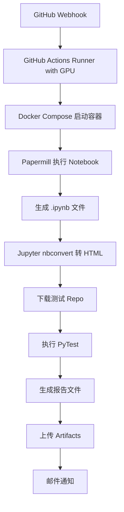
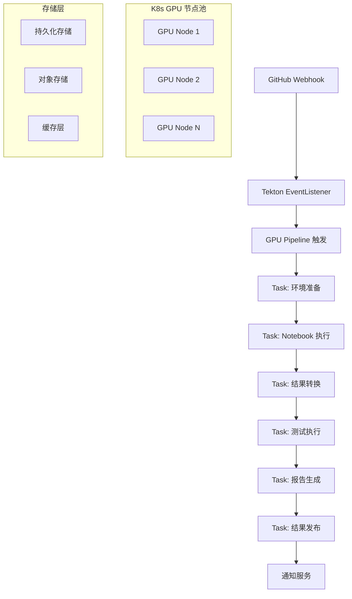

# GPU 科学计算 CI 流程迁移方案

从 GitHub Actions 迁移到 Tekton 的生产级 GPU CI/CD 解决方案

## 📋 目录

1. [现状分析](#现状分析)
2. [目标架构](#目标架构)
3. [GPU 资源管理方案](#gpu-资源管理方案)
4. [Pipeline 设计](#pipeline-设计)
5. [存储和工作空间](#存储和工作空间)
6. [容器镜像策略](#容器镜像策略)
7. [监控和报告](#监控和报告)
8. [安全和权限](#安全和权限)
9. [部署和运维](#部署和运维)
10. [迁移路线图](#迁移路线图)

## 🔍 现状分析

### 当前 GitHub Actions 流程



### 当前流程特点

- ✅ **资源**: GPU 支持的 VM Runner
- ✅ **隔离**: Docker 容器隔离
- ✅ **依赖**: papermill、jupyter、poetry 工具链
- ✅ **输出**: HTML 报告、测试结果、覆盖率报告
- ⚠️ **限制**: 单节点执行，资源利用率低
- ⚠️ **扩展性**: 难以处理多并发任务

## 🎯 目标架构

### Tekton 迁移后架构



### 架构优势

- 🚀 **弹性扩展**: 根据负载自动调度 GPU 资源
- 🔄 **并行处理**: 支持多个 Notebook 并行执行
- 📊 **资源效率**: GPU 资源池化管理
- 🛡️ **故障恢复**: 自动重试和故障转移
- 📈 **可观测性**: 完整的监控和日志系统

## 🎮 GPU 资源管理方案

### 1. GPU 节点配置

#### 节点标签和污点策略

```yaml
# GPU 节点标签
metadata:
  labels:
    node-type: gpu-compute
    gpu-type: nvidia-tesla-v100  # 或其他 GPU 型号
    gpu-count: "4"
    workload: scientific-computing

# 污点配置（确保只有 GPU 工作负载调度到 GPU 节点）
spec:
  taints:
  - key: nvidia.com/gpu
    value: "true"
    effect: NoSchedule
```

#### GPU Operator 部署

```bash
# 1. 安装 NVIDIA GPU Operator
helm repo add nvidia https://nvidia.github.io/k8s-device-plugin
helm repo update

# 2. 部署 GPU Operator
helm install gpu-operator nvidia/gpu-operator \
  --namespace gpu-operator-resources \
  --create-namespace \
  --set operator.defaultRuntime=containerd
```

### 2. GPU 资源请求策略

#### 资源配额管理

```yaml
# GPU 资源配额
apiVersion: v1
kind: ResourceQuota
metadata:
  name: gpu-quota
  namespace: tekton-gpu-pipelines
spec:
  hard:
    requests.nvidia.com/gpu: "8"  # 总 GPU 请求限制
    limits.nvidia.com/gpu: "8"
    requests.memory: "64Gi"
    requests.cpu: "16"
```

#### GPU 共享策略

```yaml
# 多实例 GPU (MIG) 配置
apiVersion: v1
kind: ConfigMap
metadata:
  name: gpu-sharing-config
data:
  config.yaml: |
    sharing:
      timeSlicing:
        resources:
        - name: nvidia.com/gpu
          replicas: 4  # 每个物理 GPU 虚拟为 4 个
```

### 3. GPU 任务调度优化

#### 节点亲和性配置

```yaml
# 科学计算工作负载优先调度到高性能 GPU 节点
spec:
  affinity:
    nodeAffinity:
      requiredDuringSchedulingIgnoredDuringExecution:
        nodeSelectorTerms:
        - matchExpressions:
          - key: gpu-type
            operator: In
            values: ["nvidia-tesla-v100", "nvidia-a100"]
      preferredDuringSchedulingIgnoredDuringExecution:
      - weight: 100
        preference:
          matchExpressions:
          - key: gpu-count
            operator: Gt
            values: ["2"]
```

## 🔧 Pipeline 设计

### 1. 核心 Pipeline 架构

```yaml
# 科学计算 CI Pipeline
apiVersion: tekton.dev/v1
kind: Pipeline
metadata:
  name: scientific-computing-ci
  namespace: tekton-gpu-pipelines
spec:
  description: |
    GPU 加速的科学计算 Notebook CI 流水线
  params:
  - name: git-repo-url
    description: 源代码仓库 URL
  - name: git-revision
    description: Git 提交 ID
  - name: notebook-path
    description: Notebook 文件路径
    default: "notebooks/01_scRNA_analysis_preprocessing.ipynb"
  - name: gpu-count
    description: 所需 GPU 数量
    default: "1"
  
  workspaces:
  - name: source-code
    description: 源代码工作空间
  - name: notebook-output
    description: Notebook 输出工作空间
  - name: test-results
    description: 测试结果工作空间
  - name: gpu-cache
    description: GPU 计算缓存工作空间
```

### 2. Task 分解设计

#### Task 1: 环境准备和代码检出

```yaml
# 职责：
# - Git 代码检出
# - 依赖环境检查
# - GPU 环境验证
# - 缓存预热

# 特点：
# - 不需要 GPU 资源
# - 快速执行（< 2 分钟）
# - 为后续 GPU 任务做准备
```

#### Task 2: Notebook 执行（GPU 密集型）

```yaml
# 职责：
# - 使用 papermill 执行 Notebook
# - GPU 加速科学计算
# - 生成中间结果文件
# - 性能监控和日志记录

# 资源需求：
# - GPU: 1-4 个（可配置）
# - 内存: 16-32GB
# - CPU: 4-8 核
# - 存储: 高性能 NVMe
```

#### Task 3: 结果转换和验证

```yaml
# 职责：
# - Jupyter nbconvert HTML 转换
# - 结果文件验证
# - 格式标准化
# - 元数据提取

# 特点：
# - 不需要 GPU 资源
# - I/O 密集型操作
# - 可以在普通节点执行
```

#### Task 4: 测试执行

```yaml
# 职责：
# - 下载测试框架 repo
# - 配置测试环境
# - 执行 pytest 测试套件
# - 生成测试报告

# 资源需求：
# - 中等计算资源
# - 网络访问权限
# - 临时存储空间
```

#### Task 5: 报告聚合和发布

```yaml
# 职责：
# - 聚合所有测试结果
# - 生成综合报告
# - 上传到对象存储
# - 触发通知服务

# 特点：
# - 轻量级任务
# - 外部服务集成
# - 最终状态确认
```

### 3. 并行执行优化

```yaml
# 并行执行策略
tasks:
- name: prepare-environment
  taskRef:
    name: env-preparation
  
- name: execute-notebook-gpu
  taskRef:
    name: notebook-execution-gpu
  runAfter: ["prepare-environment"]
  
- name: convert-results
  taskRef:
    name: result-conversion
  runAfter: ["execute-notebook-gpu"]
  
- name: download-test-framework
  taskRef:
    name: test-framework-setup
  runAfter: ["prepare-environment"]  # 与 GPU 任务并行
  
- name: execute-tests
  taskRef:
    name: test-execution
  runAfter: ["convert-results", "download-test-framework"]
  
- name: publish-results
  taskRef:
    name: result-publishing
  runAfter: ["execute-tests"]
```

## 💾 存储和工作空间

### 1. 存储层设计

#### 高性能存储（GPU 计算用）

```yaml
# NVMe SSD 存储类
apiVersion: storage.k8s.io/v1
kind: StorageClass
metadata:
  name: gpu-nvme-ssd
provisioner: kubernetes.io/aws-ebs  # 或其他云提供商
parameters:
  type: gp3
  iops: "10000"
  throughput: "1000"
  fsType: ext4
volumeBindingMode: WaitForFirstConsumer
```

#### 持久化存储（结果保存）

```yaml
# 结果持久化存储
apiVersion: storage.k8s.io/v1
kind: StorageClass
metadata:
  name: gpu-results-storage
provisioner: kubernetes.io/aws-efs  # 网络文件系统
parameters:
  provisioningMode: efs-utils
  directoryPerms: "0755"
  uid: "1000"
  gid: "1000"
```

### 2. 工作空间配置

#### GPU 缓存工作空间

```yaml
# GPU 计算缓存，提高复用性
- name: gpu-cache
  persistentVolumeClaim:
    claimName: gpu-cache-pvc
    storageClass: gpu-nvme-ssd
    accessModes: ["ReadWriteOnce"]
    resources:
      requests:
        storage: 500Gi
```

#### 共享结果工作空间

```yaml
# 跨 Task 共享的结果存储
- name: shared-results
  persistentVolumeClaim:
    claimName: shared-results-pvc
    storageClass: gpu-results-storage
    accessModes: ["ReadWriteMany"]
    resources:
      requests:
        storage: 100Gi
```

## 🐳 容器镜像策略

### 1. 镜像层级设计

#### 基础镜像层

```dockerfile
# 基础 GPU 运行时镜像
FROM nvidia/cuda:11.8-devel-ubuntu22.04

# 系统依赖
RUN apt-get update && apt-get install -y \
    python3.10 \
    python3-pip \
    git \
    curl \
    && rm -rf /var/lib/apt/lists/*

# GPU 运行时环境
ENV NVIDIA_VISIBLE_DEVICES=all
ENV NVIDIA_DRIVER_CAPABILITIES=compute,utility
```

#### 科学计算镜像层

```dockerfile
# 科学计算工具链
FROM gpu-base:latest

# Python 科学计算环境
RUN pip install --no-cache-dir \
    jupyter \
    papermill \
    numpy \
    pandas \
    scipy \
    scikit-learn \
    torch \
    tensorflow-gpu \
    cupy-cuda118

# Jupyter 优化配置
COPY jupyter_config.py /etc/jupyter/
```

#### 应用镜像层

```dockerfile
# 具体应用镜像
FROM scientific-computing:latest

# 应用特定依赖
COPY requirements.txt .
RUN pip install --no-cache-dir -r requirements.txt

# 应用代码和配置
COPY scripts/ /app/scripts/
WORKDIR /app
```

### 2. 镜像优化策略

#### 多阶段构建

```dockerfile
# 构建阶段
FROM scientific-computing:latest AS builder
COPY . /build
WORKDIR /build
RUN python setup.py bdist_wheel

# 运行时镜像
FROM gpu-base:latest AS runtime
COPY --from=builder /build/dist/*.whl /tmp/
RUN pip install /tmp/*.whl && rm /tmp/*.whl
```

#### 镜像缓存策略

```yaml
# 镜像预拉取 DaemonSet
apiVersion: apps/v1
kind: DaemonSet
metadata:
  name: gpu-image-puller
spec:
  selector:
    matchLabels:
      name: gpu-image-puller
  template:
    spec:
      nodeSelector:
        node-type: gpu-compute
      containers:
      - name: image-puller
        image: alpine:latest
        command: ["/bin/sh", "-c"]
        args:
        - |
          docker pull scientific-computing:latest
          docker pull notebook-executor:latest
          sleep infinity
```

## 📊 监控和报告

### 1. GPU 资源监控

#### Prometheus 监控配置

```yaml
# GPU 指标采集
apiVersion: v1
kind: ConfigMap
metadata:
  name: gpu-monitoring-config
data:
  prometheus.yml: |
    scrape_configs:
    - job_name: 'gpu-metrics'
      kubernetes_sd_configs:
      - role: pod
        namespaces:
          names: ['tekton-gpu-pipelines']
      relabel_configs:
      - source_labels: [__meta_kubernetes_pod_annotation_prometheus_io_scrape]
        action: keep
        regex: true
      - source_labels: [__meta_kubernetes_pod_annotation_prometheus_io_path]
        action: replace
        target_label: __metrics_path__
        regex: (.+)
```

#### 关键监控指标

```yaml
# GPU 利用率监控
- name: gpu_utilization
  query: nvidia_gpu_utilization_percent
  description: GPU 利用率百分比

# GPU 内存使用
- name: gpu_memory_usage
  query: nvidia_gpu_memory_used_bytes / nvidia_gpu_memory_total_bytes * 100
  description: GPU 内存使用率

# Pipeline 执行时间
- name: pipeline_duration
  query: tekton_pipelinerun_duration_seconds
  description: Pipeline 执行时间

# 任务成功率
- name: task_success_rate
  query: rate(tekton_taskrun_status{status="success"}[5m])
  description: 任务成功率
```

### 2. 报告生成系统

#### 报告聚合 Task

```yaml
# 综合报告生成
apiVersion: tekton.dev/v1
kind: Task
metadata:
  name: generate-comprehensive-report
spec:
  description: 生成包含性能、质量、资源使用的综合报告
  params:
  - name: pipeline-run-name
  - name: execution-time
  - name: gpu-utilization
  steps:
  - name: generate-report
    image: report-generator:latest
    script: |
      #!/bin/bash
      python /scripts/generate_report.py \
        --pipeline-run $(params.pipeline-run-name) \
        --execution-time $(params.execution-time) \
        --gpu-utilization $(params.gpu-utilization) \
        --output-format html,pdf,json
```

#### 通知集成

```yaml
# Slack/Email 通知配置
apiVersion: v1
kind: ConfigMap
metadata:
  name: notification-config
data:
  config.yaml: |
    notifications:
      slack:
        webhook_url: "${SLACK_WEBHOOK_URL}"
        channels:
          success: "#ci-success"
          failure: "#ci-alerts"
      email:
        smtp_server: "${SMTP_SERVER}"
        recipients:
          - team@company.com
          - devops@company.com
```

## 🔒 安全和权限

### 1. RBAC 配置

#### ServiceAccount 权限

```yaml
# GPU Pipeline ServiceAccount
apiVersion: v1
kind: ServiceAccount
metadata:
  name: gpu-pipeline-sa
  namespace: tekton-gpu-pipelines

---
# ClusterRole for GPU access
apiVersion: rbac.authorization.k8s.io/v1
kind: ClusterRole
metadata:
  name: gpu-pipeline-role
rules:
- apiGroups: [""]
  resources: ["pods", "persistentvolumeclaims"]
  verbs: ["get", "list", "create", "delete"]
- apiGroups: [""]
  resources: ["secrets", "configmaps"]
  verbs: ["get", "list"]
- apiGroups: ["metrics.k8s.io"]
  resources: ["pods", "nodes"]
  verbs: ["get", "list"]
```

### 2. 镜像安全

#### 镜像签名验证

```yaml
# Cosign 镜像签名验证
apiVersion: v1
kind: ConfigMap
metadata:
  name: image-security-policy
data:
  policy.yaml: |
    apiVersion: v1alpha1
    kind: ClusterImagePolicy
    metadata:
      name: gpu-images-policy
    spec:
      images:
      - glob: "registry.company.com/gpu/*"
      authorities:
      - keyless:
          url: "https://fulcio.sigstore.dev"
          identities:
          - issuer: "https://accounts.google.com"
            subject: "ci-system@company.com"
```

### 3. 网络安全

#### 网络策略

```yaml
# GPU Pipeline 网络隔离
apiVersion: networking.k8s.io/v1
kind: NetworkPolicy
metadata:
  name: gpu-pipeline-netpol
  namespace: tekton-gpu-pipelines
spec:
  podSelector:
    matchLabels:
      app: gpu-pipeline
  policyTypes:
  - Ingress
  - Egress
  egress:
  - to:
    - namespaceSelector:
        matchLabels:
          name: kube-system
  - to: []
    ports:
    - protocol: TCP
      port: 443  # HTTPS 外部访问
    - protocol: TCP
      port: 80   # HTTP 外部访问
```

## 🚀 部署和运维

### 1. 渐进式部署策略

#### 阶段 1: 基础设施准备

```yaml
# 部署检查清单
infrastructure_checklist:
  - ✅ GPU Operator 安装
  - ✅ 存储类配置
  - ✅ 网络策略配置
  - ✅ 监控系统部署
  - ✅ 镜像仓库准备
```

#### 阶段 2: Pipeline 部署

```yaml
# Pipeline 部署顺序
deployment_order:
  1. 基础 Tasks 部署
  2. GPU Tasks 部署和测试
  3. 完整 Pipeline 集成测试
  4. 生产环境验证
```

#### 阶段 3: 流量切换

```yaml
# 灰度发布策略
traffic_splitting:
  phase1: 10%  # 小规模验证
  phase2: 50%  # 并行运行对比
  phase3: 100% # 完全切换
```

### 2. 运维自动化

#### 自动扩缩容

```yaml
# GPU 节点自动扩缩容
apiVersion: autoscaling/v2
kind: HorizontalPodAutoscaler
metadata:
  name: gpu-pipeline-hpa
spec:
  scaleTargetRef:
    apiVersion: apps/v1
    kind: Deployment
    name: gpu-worker-pool
  minReplicas: 2
  maxReplicas: 10
  metrics:
  - type: Resource
    resource:
      name: nvidia.com/gpu
      target:
        type: Utilization
        averageUtilization: 70
```

#### 自动清理

```yaml
# 定期清理 CronJob
apiVersion: batch/v1
kind: CronJob
metadata:
  name: pipeline-cleanup
spec:
  schedule: "0 2 * * *"  # 每天凌晨 2 点
  jobTemplate:
    spec:
      template:
        spec:
          containers:
          - name: cleanup
            image: cleanup-tool:latest
            command:
            - /bin/sh
            - -c
            - |
              # 清理完成的 PipelineRuns (保留最近 7 天)
              tkn pipelinerun delete --keep 7
              
              # 清理未使用的 PVCs
              kubectl delete pvc --field-selector=status.phase=Available
```

## 📋 迁移路线图

### 第一阶段：基础设施准备（2-3 周）

#### 周 1-2: GPU 集群准备
- [ ] GPU Operator 部署和配置
- [ ] 存储类和持久化卷配置
- [ ] 网络策略和安全配置
- [ ] 监控系统集成

#### 周 3: 镜像和工具链准备
- [ ] 基础镜像构建和优化
- [ ] 镜像仓库配置和安全策略
- [ ] 镜像预拉取和缓存策略
- [ ] 工具链验证测试

### 第二阶段：Pipeline 开发（3-4 周）

#### 周 1-2: 核心 Tasks 开发
- [ ] 环境准备 Task 开发和测试
- [ ] GPU Notebook 执行 Task 开发
- [ ] 结果转换 Task 开发
- [ ] 测试执行 Task 开发
- [ ] 报告生成 Task 开发

#### 周 3-4: Pipeline 集成
- [ ] 完整 Pipeline 组装和配置
- [ ] 工作空间和存储集成
- [ ] 参数化和配置管理
- [ ] 错误处理和重试机制

### 第三阶段：验证和优化（2-3 周）

#### 周 1-2: 功能验证
- [ ] 单 Task 功能测试
- [ ] 端到端 Pipeline 测试
- [ ] 性能基准测试
- [ ] 故障恢复测试

#### 周 3: 性能优化
- [ ] GPU 资源利用率优化
- [ ] 并行执行优化
- [ ] 存储 I/O 优化
- [ ] 网络传输优化

### 第四阶段：生产部署（2-3 周）

#### 周 1: 灰度部署
- [ ] 10% 流量切换
- [ ] 性能和稳定性监控
- [ ] 问题修复和调优

#### 周 2: 扩大部署
- [ ] 50% 流量切换
- [ ] 并行运行对比验证
- [ ] 用户体验收集

#### 周 3: 全量切换
- [ ] 100% 流量切换
- [ ] 原系统备用保留
- [ ] 运维文档和培训

## 📈 预期收益

### 1. 资源效率提升

- **GPU 利用率**: 从 30-40% 提升到 70-80%
- **并发处理**: 支持 3-5 倍并发任务量
- **成本降低**: GPU 资源成本降低 40-50%

### 2. 可靠性提升

- **故障恢复**: 自动重试和故障转移
- **可观测性**: 完整的监控和告警
- **可维护性**: 标准化的运维流程

### 3. 开发效率提升

- **开发周期**: CI/CD 周期缩短 30-40%
- **反馈速度**: 更快的测试反馈
- **扩展性**: 更容易添加新的计算任务

## 🎯 成功指标

### 技术指标

- GPU 平均利用率 > 70%
- Pipeline 成功率 > 95%
- 平均执行时间 < 30 分钟
- 故障恢复时间 < 5 分钟

### 业务指标

- 开发者满意度 > 4.5/5
- 部署频率提升 2x
- 问题解决时间减少 50%
- 总体运维成本降低 30%

---

**注意**: 本方案基于生产环境最佳实践设计，考虑了可扩展性、可靠性和安全性。建议根据实际环境和需求进行适当调整。 