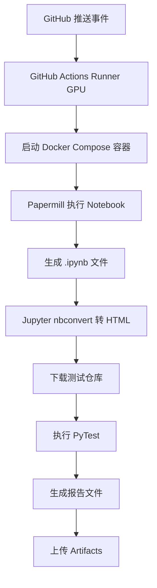
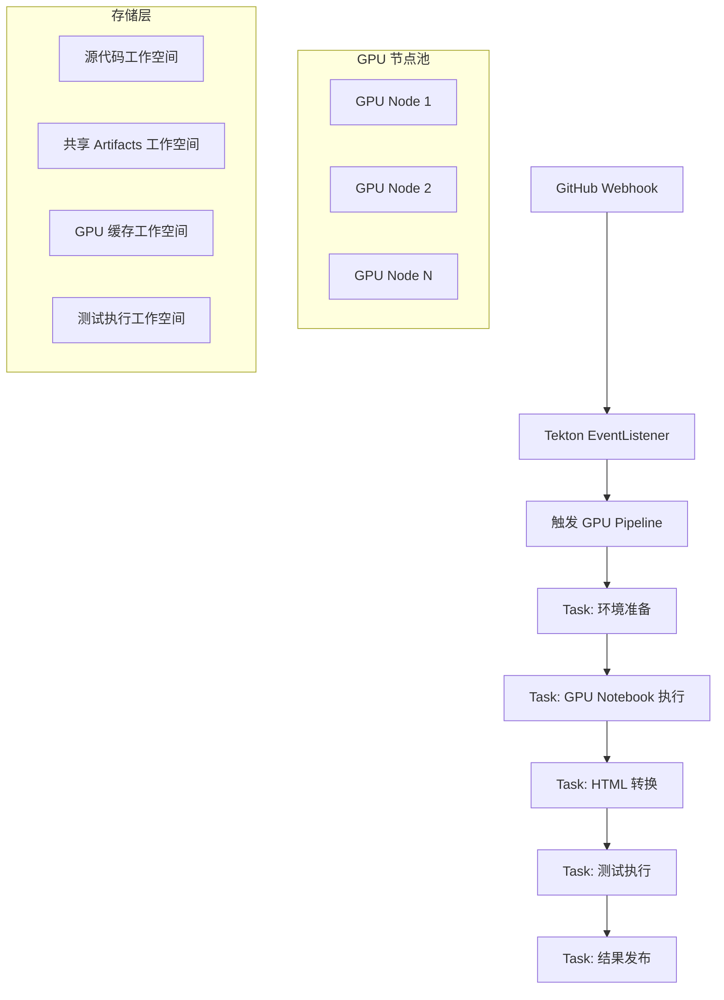

# GPU 科学计算 Tekton Pipeline 迁移指南

将 GitHub Actions GPU 工作流迁移到 Tekton 的完整指南

## 📋 目录

1. [概述](#概述)
2. [架构对比](#架构对比)
3. [环境准备](#环境准备)
4. [快速部署](#快速部署)
5. [详细配置](#详细配置)
6. [使用指南](#使用指南)
7. [监控与调试](#监控与调试)
8. [性能优化](#性能优化)
9. [故障排除](#故障排除)
10. [最佳实践](#最佳实践)

## 🎯 概述

本指南帮助您将现有的 GitHub Actions GPU 科学计算工作流完整迁移到 Tekton，实现：

### 原 GitHub Actions 工作流程



### 新 Tekton Pipeline 架构



### 迁移优势

- ✅ **弹性扩展**: 自动 GPU 资源调度和负载均衡
- ✅ **成本优化**: 按需使用 GPU 资源，避免资源浪费
- ✅ **高可用性**: 容器化运行，自动故障恢复
- ✅ **标准化**: 基于 Kubernetes 原生工具链
- ✅ **可观测性**: 完整的日志、监控和告警

## 🔄 架构对比

### GitHub Actions vs Tekton

| 特性 | GitHub Actions | Tekton |
|------|---------------|--------|
| **运行环境** | VM-based Runners | Kubernetes Pods |
| **GPU 调度** | 固定 Runner | K8s GPU 调度器 |
| **资源利用** | 独占式 | 共享式，高效利用 |
| **扩展性** | 手动扩展 | 自动弹性扩展 |
| **存储** | Runner 本地存储 | PV/PVC 持久化存储 |
| **监控** | Actions 内置 | Prometheus + Grafana |
| **成本** | 按 Runner 时间计费 | 按实际资源使用计费 |

### 工作流对应关系

| GitHub Actions 步骤 | Tekton Task | 说明 |
|-------------------|-------------|-----|
| 代码检出 | `gpu-env-preparation` | Git clone + 环境验证 |
| Docker Compose 启动 | `gpu-papermill-execution` | GPU 容器中执行 Papermill |
| Papermill 执行 | `gpu-papermill-execution` | 使用 GPU 执行 Notebook |
| Jupyter nbconvert | `jupyter-nbconvert` | 转换为 HTML 格式 |
| 下载测试仓库 + PyTest | `pytest-execution` | 测试框架下载和执行 |
| 上传 Artifacts | `publish-results` | 结果收集和发布 |

## 🛠️ 环境准备

### 前置要求

#### 1. Kubernetes 集群要求

```bash
# 检查集群版本（推荐 1.24+）
kubectl version --short

# 检查 GPU 支持
kubectl get nodes -o wide
kubectl describe node <gpu-node-name>
```

#### 2. GPU 节点配置

```bash
# 安装 NVIDIA GPU Operator（如果未安装）
kubectl apply -f https://raw.githubusercontent.com/NVIDIA/gpu-operator/main/deployments/gpu-operator.yaml

# 标记 GPU 节点
kubectl label nodes <gpu-node-name> accelerator=nvidia-tesla-gpu

# 验证 GPU 资源
kubectl get nodes -o jsonpath='{.items[*].status.allocatable.nvidia\.com/gpu}'
```

#### 3. 存储配置

```yaml
# 高性能存储类示例
apiVersion: storage.k8s.io/v1
kind: StorageClass
metadata:
  name: fast-ssd
provisioner: kubernetes.io/aws-ebs
parameters:
  type: gp3
  iops: "3000"
  throughput: "125"
volumeBindingMode: WaitForFirstConsumer
```

#### 4. Tekton 安装

```bash
# 安装 Tekton Pipelines
kubectl apply -f https://storage.googleapis.com/tekton-releases/pipeline/latest/release.yaml

# 安装 Tekton Triggers
kubectl apply -f https://storage.googleapis.com/tekton-releases/triggers/latest/release.yaml
kubectl apply -f https://storage.googleapis.com/tekton-releases/triggers/latest/interceptors.yaml

# 验证安装
kubectl get pods -n tekton-pipelines
kubectl get crd | grep tekton
```

## 🚀 快速部署

### 一键部署脚本

```bash
# 克隆项目
git clone https://github.com/your-org/Real-world_Tekton_Installation_Guide.git
cd Real-world_Tekton_Installation_Guide

# 执行中文部署脚本
chmod +x scripts/zh/deploy-gpu-pipeline.sh
./scripts/zh/deploy-gpu-pipeline.sh

# 或者执行英文部署脚本
chmod +x scripts/en/deploy-gpu-pipeline.sh
./scripts/en/deploy-gpu-pipeline.sh
```

### 部署验证

```bash
# 检查所有组件状态
kubectl get tasks,pipelines,eventlisteners -n tekton-pipelines

# 查看 EventListener 服务
kubectl get svc -n tekton-pipelines
kubectl describe eventlistener gpu-scientific-computing-eventlistener -n tekton-pipelines
```

## ⚙️ 详细配置

### 1. Tasks 配置详解

#### GPU 环境准备 Task

```yaml
# examples/tasks/gpu-env-preparation-task.yaml
apiVersion: tekton.dev/v1
kind: Task
metadata:
  name: gpu-env-preparation
spec:
  description: |
    Environment preparation for GPU scientific computing workflow
  params:
  - name: git-repo-url
    description: Git repository URL to clone
  - name: git-revision
    description: Git revision to checkout
    default: "main"
  workspaces:
  - name: source-code
    description: Workspace for source code checkout
  - name: shared-storage
    description: Shared storage for artifacts
  # ... 详细配置见实际文件
```

#### GPU Papermill 执行 Task

```yaml
# examples/tasks/gpu-papermill-execution-task.yaml
apiVersion: tekton.dev/v1
kind: Task
metadata:
  name: gpu-papermill-execution
  labels:
    tekton.dev/gpu-required: "true"
spec:
  description: |
    GPU-accelerated Papermill execution task
  params:
  - name: gpu-count
    description: Number of GPUs required
    default: "1"
  - name: memory-limit
    description: Memory limit for the container
    default: "32Gi"
  - name: container-image
    description: GPU-enabled container image
    default: "nvcr.io/nvidia/rapidsai/notebooks:25.04-cuda12.8-py3.12"
  # ... GPU 资源配置
  resources:
    limits:
      nvidia.com/gpu: $(params.gpu-count)
      memory: $(params.memory-limit)
      cpu: "8"
    requests:
      nvidia.com/gpu: $(params.gpu-count)
      memory: "16Gi"
      cpu: "4"
```

### 2. Pipeline 配置

```yaml
# examples/pipelines/gpu-scientific-computing-pipeline.yaml
apiVersion: tekton.dev/v1
kind: Pipeline
metadata:
  name: gpu-scientific-computing-pipeline
spec:
  description: |
    GPU-accelerated scientific computing pipeline
  params:
  - name: git-repo-url
    description: Git repository URL
  - name: gpu-count
    description: Number of GPUs required
    default: "1"
  workspaces:
  - name: source-code-workspace
  - name: shared-artifacts-workspace
  - name: gpu-cache-workspace
  - name: test-execution-workspace
  
  tasks:
  - name: prepare-environment
    taskRef:
      name: gpu-env-preparation
  - name: execute-notebook-gpu
    taskRef:
      name: gpu-papermill-execution
    runAfter: ["prepare-environment"]
  - name: convert-to-html
    taskRef:
      name: jupyter-nbconvert
    runAfter: ["execute-notebook-gpu"]
  - name: run-tests
    taskRef:
      name: pytest-execution
    runAfter: ["convert-to-html"]
  - name: publish-results
    runAfter: ["run-tests"]
    # ... 内联 Task 定义
```

### 3. Triggers 配置

#### EventListener

```yaml
# examples/triggers/gpu-pipeline-trigger-template.yaml
apiVersion: triggers.tekton.dev/v1beta1
kind: EventListener
metadata:
  name: gpu-scientific-computing-eventlistener
spec:
  triggers:
  - name: gpu-scientific-computing-trigger
    interceptors:
    # GitHub webhook 拦截器
    - ref:
        name: "github"
      params:
      - name: "secretRef"
        value:
          secretName: github-webhook-secret
          secretKey: webhook-secret
      - name: "eventTypes"
        value: ["push", "pull_request"]
    
    # CEL 过滤器
    - ref:
        name: "cel"
      params:
      - name: "filter"
        value: >
          (body.ref == 'refs/heads/main' || 
           body.ref == 'refs/heads/develop') &&
          (body.head_commit.message.contains('[gpu]') ||
           body.head_commit.message.contains('[notebook]') ||
           body.head_commit.modified.exists(f, f.contains('notebooks/')))
```

### 4. GitHub Webhook 配置

#### 设置步骤

1. 进入 GitHub 仓库设置
2. 选择 "Webhooks" > "Add webhook"
3. 配置参数：

```
Payload URL: http://<EXTERNAL_IP>:8080
Content type: application/json
Secret: <WEBHOOK_SECRET>  # 部署脚本生成的密钥
SSL verification: Enable SSL verification (如果使用 HTTPS)
Events: Just the push event 或 Send me everything
```

#### 触发条件

Pipeline 会在以下情况自动触发：

- 推送到 `main` 或 `develop` 分支
- 提交消息包含 `[gpu]` 或 `[notebook]` 标签
- 修改 `notebooks/` 目录下的文件

## 📖 使用指南

### 手动执行 Pipeline

```bash
# 创建手动执行的 PipelineRun
cat <<EOF | kubectl apply -f -
apiVersion: tekton.dev/v1
kind: PipelineRun
metadata:
  generateName: gpu-manual-run-
  namespace: tekton-pipelines
spec:
  pipelineRef:
    name: gpu-scientific-computing-pipeline
  params:
  - name: git-repo-url
    value: "https://github.com/your-org/your-repo.git"
  - name: git-revision
    value: "main"
  - name: notebook-path
    value: "notebooks/01_scRNA_analysis_preprocessing.ipynb"
  - name: gpu-count
    value: "1"
  workspaces:
  - name: source-code-workspace
    volumeClaimTemplate:
      spec:
        accessModes: ["ReadWriteOnce"]
        resources:
          requests:
            storage: 10Gi
        storageClassName: fast-ssd
  - name: shared-artifacts-workspace
    volumeClaimTemplate:
      spec:
        accessModes: ["ReadWriteOnce"]
        resources:
          requests:
            storage: 50Gi
        storageClassName: fast-ssd
  - name: gpu-cache-workspace
    volumeClaimTemplate:
      spec:
        accessModes: ["ReadWriteOnce"]
        resources:
          requests:
            storage: 100Gi
        storageClassName: fast-nvme
  - name: test-execution-workspace
    volumeClaimTemplate:
      spec:
        accessModes: ["ReadWriteOnce"]
        resources:
          requests:
            storage: 5Gi
        storageClassName: fast-ssd
  timeout: "2h"
EOF
```

### 查看执行状态

```bash
# 查看 PipelineRun 列表
kubectl get pipelineruns -n tekton-pipelines

# 查看特定 PipelineRun 详情
kubectl describe pipelinerun <pipelinerun-name> -n tekton-pipelines

# 查看 TaskRun 状态
kubectl get taskruns -n tekton-pipelines

# 查看 Pod 状态
kubectl get pods -n tekton-pipelines
```

### 查看日志

```bash
# 查看 PipelineRun 日志
kubectl logs -f -n tekton-pipelines <pipelinerun-pod-name>

# 查看特定 Task 日志
kubectl logs -f -n tekton-pipelines <taskrun-pod-name> -c step-<step-name>

# 查看 GPU 执行 Task 日志
kubectl logs -f -n tekton-pipelines <gpu-papermill-pod-name> -c step-gpu-papermill-execute
```

## 📊 监控与调试

### 监控指标

#### 1. 集群级别监控

```bash
# GPU 资源使用情况
kubectl top nodes
kubectl get nodes -o jsonpath='{.items[*].status.allocatable.nvidia\.com/gpu}'

# 存储使用情况
kubectl get pv
kubectl top pods -n tekton-pipelines
```

#### 2. Pipeline 监控

```bash
# Pipeline 执行历史
kubectl get pipelineruns -n tekton-pipelines -o wide

# 成功率统计
kubectl get pipelineruns -n tekton-pipelines -o jsonpath='{.items[*].status.conditions[0].reason}' | tr ' ' '\n' | sort | uniq -c

# 执行时间分析
kubectl get pipelineruns -n tekton-pipelines -o custom-columns=NAME:.metadata.name,START:.status.startTime,COMPLETION:.status.completionTime
```

#### 3. 资源监控

```yaml
# Prometheus 监控配置示例
apiVersion: v1
kind: ServiceMonitor
metadata:
  name: tekton-pipelines-monitor
spec:
  selector:
    matchLabels:
      app: tekton-pipelines
  endpoints:
  - port: metrics
    interval: 30s
    path: /metrics
```

### 调试技巧

#### 1. 常见问题诊断

```bash
# 检查 GPU 资源可用性
kubectl describe node <gpu-node-name> | grep -A 10 "Allocated resources"

# 检查存储类和 PVC
kubectl get storageclass
kubectl get pvc -n tekton-pipelines

# 检查 Pod 调度情况
kubectl get pods -n tekton-pipelines -o wide
kubectl describe pod <stuck-pod-name> -n tekton-pipelines
```

#### 2. 日志分析

```bash
# 检查 EventListener 日志
kubectl logs -f deployment/el-gpu-scientific-computing-eventlistener -n tekton-pipelines

# 检查 Webhook 触发日志
kubectl logs -f -l app=tekton-triggers-controller -n tekton-pipelines

# 检查 GPU Task 执行日志
kubectl logs -f <gpu-task-pod> -n tekton-pipelines -c step-gpu-papermill-execute
```

#### 3. 性能分析

```bash
# 分析 GPU 利用率
kubectl exec -it <gpu-pod-name> -n tekton-pipelines -- nvidia-smi

# 分析存储 I/O
kubectl exec -it <task-pod> -n tekton-pipelines -- iostat -x 1

# 分析内存使用
kubectl top pod <pod-name> -n tekton-pipelines --containers
```

## ⚡ 性能优化

### 1. GPU 资源优化

#### GPU 节点池配置

```yaml
# GPU 节点池亲和性
apiVersion: apps/v1
kind: Deployment
metadata:
  name: gpu-workload
spec:
  template:
    spec:
      nodeSelector:
        accelerator: nvidia-tesla-gpu
      tolerations:
      - key: nvidia.com/gpu
        operator: Exists
        effect: NoSchedule
      affinity:
        nodeAffinity:
          preferredDuringSchedulingIgnoredDuringExecution:
          - weight: 100
            preference:
              matchExpressions:
              - key: gpu-memory
                operator: Gt
                values: ["16000"]
```

#### GPU 多实例配置

```yaml
# GPU Multi-Instance GPU (MIG) 配置
resources:
  limits:
    nvidia.com/gpu: 1  # 完整 GPU
    # 或者使用 MIG 实例
    nvidia.com/mig-1g.5gb: 1  # 1/7 GPU 实例
```

### 2. 存储优化

#### 缓存策略

```yaml
# GPU 缓存卷配置
- name: gpu-cache-workspace
  persistentVolumeClaim:
    claimName: gpu-cache-pvc
    # 使用本地 NVMe 存储
    storageClass: local-nvme
    # 启用缓存预热
    accessModes: ["ReadWriteOnce"]
    resources:
      requests:
        storage: 500Gi
```

#### 数据预加载

```bash
# 预加载常用数据集
kubectl create configmap common-datasets \
  --from-file=dataset1.csv \
  --from-file=dataset2.parquet \
  -n tekton-pipelines
```

### 3. 并行化优化

#### Task 并行执行

```yaml
# 并行 Task 配置
tasks:
- name: download-test-framework
  taskRef:
    name: test-framework-setup
  runAfter: ["prepare-environment"]  # 与 GPU Task 并行

- name: execute-notebook-gpu
  taskRef:
    name: gpu-papermill-execution
  runAfter: ["prepare-environment"]  # 并行执行
```

#### 工作空间共享优化

```yaml
# 使用 ReadWriteMany 卷提高并发性能
workspaces:
- name: shared-data
  persistentVolumeClaim:
    claimName: shared-data-pvc
    accessModes: ["ReadWriteMany"]  # 支持多 Pod 同时访问
    storageClassName: efs-storage-class
```

## 🔧 故障排除

### 常见问题及解决方案

#### 1. GPU 调度失败

**问题**: Pod 无法调度到 GPU 节点

```bash
# 诊断步骤
kubectl describe pod <pod-name> -n tekton-pipelines
# 查看 Events 部分的错误信息

# 常见原因和解决方案
# 1. GPU 资源不足
kubectl get nodes -o jsonpath='{.items[*].status.allocatable.nvidia\.com/gpu}'
kubectl describe node <gpu-node> | grep -A 10 "Allocated resources"

# 2. 节点标签缺失
kubectl label nodes <node-name> accelerator=nvidia-tesla-gpu

# 3. GPU Operator 未安装
kubectl get pods -n gpu-operator-resources
```

#### 2. 存储问题

**问题**: PVC 无法绑定或存储空间不足

```bash
# 检查存储类
kubectl get storageclass
kubectl describe storageclass fast-ssd

# 检查 PVC 状态
kubectl get pvc -n tekton-pipelines
kubectl describe pvc <pvc-name> -n tekton-pipelines

# 检查可用存储
kubectl get pv
```

#### 3. 网络连接问题

**问题**: GitHub Webhook 无法触发 Pipeline

```bash
# 检查 EventListener 服务
kubectl get svc -n tekton-pipelines
kubectl describe svc el-gpu-scientific-computing-eventlistener -n tekton-pipelines

# 检查 Webhook 配置
kubectl get eventlistener gpu-scientific-computing-eventlistener -n tekton-pipelines -o yaml

# 测试 Webhook 连接
curl -X POST http://<external-ip>:8080 \
  -H "Content-Type: application/json" \
  -d '{"test": "webhook"}'
```

#### 4. 容器镜像问题

**问题**: GPU 容器镜像拉取失败或运行异常

```bash
# 检查镜像是否可用
docker pull nvcr.io/nvidia/rapidsai/notebooks:25.04-cuda12.8-py3.12

# 检查镜像拉取策略
kubectl describe pod <pod-name> -n tekton-pipelines | grep -A 5 "Image"

# 检查镜像仓库访问权限
kubectl get secrets -n tekton-pipelines
```

### 日志收集脚本

```bash
#!/bin/bash
# 故障排除日志收集脚本

LOG_DIR="tekton-gpu-logs-$(date +%Y%m%d-%H%M%S)"
mkdir -p "$LOG_DIR"

# 收集集群信息
kubectl cluster-info > "$LOG_DIR/cluster-info.txt"
kubectl get nodes -o wide > "$LOG_DIR/nodes.txt"
kubectl get storageclass > "$LOG_DIR/storage-classes.txt"

# 收集 Tekton 组件状态
kubectl get all -n tekton-pipelines > "$LOG_DIR/tekton-resources.txt"
kubectl get pipelineruns -n tekton-pipelines -o yaml > "$LOG_DIR/pipelineruns.yaml"
kubectl get taskruns -n tekton-pipelines -o yaml > "$LOG_DIR/taskruns.yaml"

# 收集 Pod 日志
for pod in $(kubectl get pods -n tekton-pipelines -o name); do
  kubectl logs "$pod" -n tekton-pipelines > "$LOG_DIR/${pod#pod/}.log" 2>&1
done

# 收集 Events
kubectl get events -n tekton-pipelines --sort-by='.lastTimestamp' > "$LOG_DIR/events.txt"

echo "日志已收集到 $LOG_DIR 目录"
tar -czf "$LOG_DIR.tar.gz" "$LOG_DIR"
echo "压缩包: $LOG_DIR.tar.gz"
```

## 🎯 最佳实践

### 1. 资源管理

#### GPU 资源配额

```yaml
# GPU 命名空间资源配额
apiVersion: v1
kind: ResourceQuota
metadata:
  name: gpu-quota
  namespace: tekton-pipelines
spec:
  hard:
    requests.nvidia.com/gpu: "10"
    limits.nvidia.com/gpu: "10"
    requests.memory: "100Gi"
    limits.memory: "200Gi"
```

#### 资源限制和请求

```yaml
# 合理的资源配置
resources:
  requests:
    nvidia.com/gpu: "1"
    memory: "16Gi"
    cpu: "4"
  limits:
    nvidia.com/gpu: "1"
    memory: "32Gi"
    cpu: "8"
```

### 2. 安全配置

#### Pod 安全策略

```yaml
# GPU Pod 安全上下文
securityContext:
  runAsNonRoot: true
  runAsUser: 1000
  fsGroup: 1000
  capabilities:
    drop:
    - ALL
  readOnlyRootFilesystem: false  # GPU 驱动需要写权限
```

#### 密钥管理

```bash
# 安全地管理 GitHub Webhook 密钥
kubectl create secret generic github-webhook-secret \
  --from-literal=webhook-secret="$(openssl rand -base64 32)" \
  -n tekton-pipelines

# 定期轮换密钥
kubectl patch secret github-webhook-secret \
  -p='{"data":{"webhook-secret":"'$(openssl rand -base64 32 | base64 -w 0)'"}}' \
  -n tekton-pipelines
```

### 3. 监控告警

#### Prometheus 规则

```yaml
# GPU Pipeline 监控规则
apiVersion: monitoring.coreos.com/v1
kind: PrometheusRule
metadata:
  name: tekton-gpu-alerts
spec:
  groups:
  - name: tekton-gpu
    rules:
    - alert: GPUPipelineFailure
      expr: increase(tekton_pipelinerun_failed_total[5m]) > 0
      labels:
        severity: warning
      annotations:
        summary: "GPU Pipeline 执行失败"
        
    - alert: GPUResourceExhausted
      expr: nvidia_gpu_memory_used_percent > 90
      labels:
        severity: critical
      annotations:
        summary: "GPU 内存使用率过高"
```

### 4. 性能监控

#### 关键指标

- **Pipeline 成功率**: 监控 Pipeline 执行成功率
- **GPU 利用率**: 监控 GPU 计算资源使用效率
- **执行时间**: 跟踪 Notebook 执行时间趋势
- **资源消耗**: 监控内存、CPU、存储使用情况
- **队列等待时间**: 监控 GPU 资源等待时间

#### 性能基准

```bash
# 建立性能基准
# 1. Notebook 执行时间基准
echo "Notebook 执行时间应在 30 分钟内完成"

# 2. GPU 利用率基准
echo "GPU 利用率应保持在 80% 以上"

# 3. 内存使用基准
echo "内存使用不应超过 85%"

# 4. 存储 I/O 基准
echo "存储读写速度应满足 1GB/s"
```

## 📝 总结

通过本指南，您已经完成了从 GitHub Actions 到 Tekton 的 GPU 科学计算工作流迁移。主要收益包括：

1. **提升资源利用率**: GPU 资源按需分配，避免浪费
2. **增强可扩展性**: 支持多节点并行处理
3. **改善可观测性**: 完整的监控和日志体系
4. **降低运维成本**: 自动化运维和故障恢复
5. **标准化流程**: 基于 Kubernetes 生态的标准化工具链

### 后续优化建议

1. **实施分层缓存策略** 提升数据访问效率
2. **配置自动扩缩容** 根据负载动态调整资源
3. **建立完善的监控体系** 实现主动运维
4. **定期性能调优** 确保最佳执行效果
5. **制定灾备计划** 保障业务连续性

如需技术支持，请参考项目 Issues 或联系维护团队。 